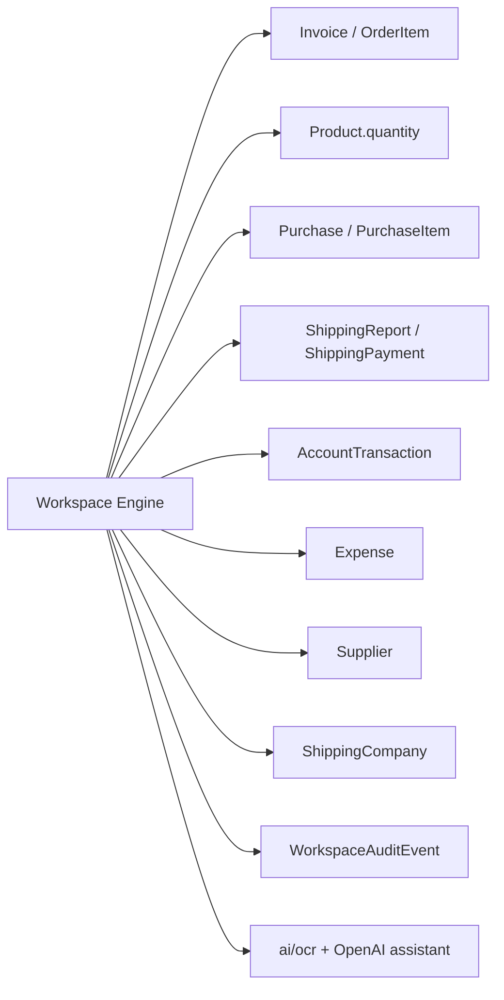

# خطة تنفيذ Finora AI Workspace Engine
## LEON Interactive Accounting Workspace

**الإصدار:** 1.0  
**التاريخ:** 2026-07-01  
**الحالة:** خطة تحليل وتخطيط — بانتظار الموافقة قبل كتابة كود الإنتاج  
**المستودع:** `accounting_system` (Finora)

---

## 1. الملخص التنفيذي

Finora هو نظام SaaS محاسبي/ERP مبني على **Flask + SQLAlchemy** مع عزل متعدد المستأجرين عبر قواعد SQLite منفصلة (`tenants/{slug}.db`). يحتوي المشروع على وحدات أعمال ناضجة (طلبات، مخزون، مشتريات، شحن، تسويات، صندوق نقدي) وطبقات AI جزئية (OCR، مساعد مالي، React Flow لأتمتة السوشيال) — لكن **لا يوجد حالياً مساحة عمل LEON التفاعلية** الموصوفة في ملف `t`.

الهدف: بناء **طبقة Workspace ذكية** فوق النظام الحالي، حيث يرفع المستخدم مستنداً (كشف تسوية شركة نقل، كشف مرتجعات، فاتورة مورد) فيتحرك أفاتار LEON داخل لوحة بيضاء تفاعلية، تُفتح نوافذ عائمة تلقائياً، يُبث التحليل تدريجياً، وتُربط كل خطوة بوحدات Finora الحقيقية — مع **موافقة إلزامية** قبل أي ترحيل مالي أو مخزني.

**القرار المعماري الرئيسي:** إنشاء وحدة معزولة `modules/workspace/` بنفس نمط `modules/publisher/` (stable + dev عبر `?dev=1`)، مع واجهة SPA خفيفة (Vite + Vanilla JS أو React حسب المرحلة) وSSE للبث الحي، وخدمات باكند حتمية (deterministic) للمطابقة والترحيل — والـ LLM يُستخدم للتصنيف والشرح والاقتراح فقط.

**المرحلة الأولى الموصى بها بعد الموافقة:** Phase 1 — Workspace Foundation (قشرة المساحة + جلسة + نوافذ + أفاتار + workflow وهمي بدون ترحيل).

---

## 2. تحليل البنية الحالية

### 2.1 نقاط الدخول والتطبيق

| الملف | الدور |
|-------|-------|
| `app.py` | التطبيق الرئيسي Flask (~1554 سطر)، منفذ 5008 |
| `app_server.py` | نسخة أخف للإنتاج |
| `config.py` | إعدادات DB، مفاتيح AI، Telegram، WhatsApp |
| `extensions.py` | SQLAlchemy + `DynamicTenantSession` |
| `extensions_tenant.py` | محركات SQLite لكل مستأجر + seed صلاحيات |

### 2.2 تدفق الطلب والمستأجر

```
تسجيل الدخول (routes/index.py)
  → session["tenant_slug"]
  → app.require_login() يضبط g.tenant
  → DynamicTenantSession.get_bind() → tenants/{slug}.db
```

- **Core DB** (Postgres افتراضياً عبر `DATABASE_URL`): `Tenant`, `SubscriptionPlan`, `SuperAdmin`
- **Tenant DB** (SQLite): كل نماذج العمليات (`Invoice`, `Product`, `Purchase`, …)

### 2.3 المكدس التقني المؤكد من المستودع

| الطبقة | التقنية الفعلية |
|--------|-----------------|
| Backend | Python 3, Flask, SQLAlchemy, APScheduler |
| Frontend رئيسي | Jinja2 templates + `static/js/` + Bootstrap/CSS مخصص |
| SPA جزئية | `static/ai_agent_frontend/` (React+Vite) عند `/social-ai/` |
| Publisher SPA | `templates/publisher/app.html` + `static/publisher_frontend/` |
| Avatar | Three.js في `static/js/assistant-character.js` |
| OCR | Tesseract (`ai/ocr.py`) + OpenCV، `ara+eng` |
| AI | OpenAI عبر `ai/ai_service.py`, `routes/assistant.py` |
| Real-time | **لا يوجد SSE/WebSocket** — polling فقط (320ms في React Flow) |
| Migrations | Alembic + patches يدوية عند startup في `app.py` |

### 2.4 إجابات أسئلة التحليل الأولي

1. **Frontend:** Jinja2 + JS؛ React فقط في `/social-ai/` و Publisher SPA
2. **Backend:** Flask blueprints
3. **Database:** SQLAlchemy؛ SQLite per tenant + Core Postgres
4. **Auth:** Session-based (`session["user_id"]`, `session["role"]`, `session["tenant_slug"]`)
5. **Multi-tenant:** نعم — `g.tenant` + `DynamicTenantSession`
6. **وحدات موجودة:** طلبات، POS، مخزون، منتجات، زبائن، موردون، مشتريات، مرتجعات (ضمن حالات الطلب)، شركات نقل، تسويات (`ShippingReport`), محاسبة تشغيلية (صندوق + P&L)، تقارير، إعدادات، رفع ملفات جزئي
7. **API routes:** `routes/*.py` + `api_workflows.py` + `modules/publisher/api/`
8. **صفحات UI:** `templates/` + static
9. **Types:** لا يوجد TypeScript مشترك في الباكند؛ JSON schemas ضمنية
10. **Business logic:** `routes/`, `utils/`, `modules/*/services/`
11. **Document/OCR:** `/ai/ocr`, مرفقات مشتريات، media publisher — **لا PDF table extraction**
12. **AI assistant:** `/assistant/*` — Enterprise فقط
13. **Audit log:** جزئي — `AgentExecutionLog`, `SystemAnalytics`, `AccountTransaction` — **لا workspace audit**
14. **Approval system:** يدوي في واجهات موجودة — **لا محرك موافقات موحد**
15. **Chart of accounts:** `Account`, `JournalEntry` موجودان نظرياً؛ التشغيل الفعلي عبر `AccountTransaction` (صندوق نقدي)
16. **تسوية الطلبات:** `shipping.settle_order()`, `delivery_agent.execute_report()`
17. **المرتجعات:** حالة طلب `مرتجع` + استرجاع مخزون عند الإلغاء في `shipping.cancel_order()`
18. **المشتريات:** `purchases._create_purchase_from_payload()` + `PurchaseAttachment`
19. **المنتجات:** `Product` بكمية واحدة — **لا variants منفصلة ولا multi-warehouse**
20. **فجوات رئيسية:** لا workspace، لا SSE، لا classifiers للمستندات، لا supplier mapping memory، لا variants

---

## 3. الوحدات الموجودة في المستودع

### 3.1 الطلبات (`routes/orders.py` — `orders_bp`)

- النموذج: `Invoice` + `OrderItem` (ليس جدول Order منفصل)
- حالات: مسدد، مرتجع، ملغي، تم الطلب، …
- إنشاء كشوف شحن: `ShippingReport` بأرقام `KSH-{date}-*` و `AGT-{agent}-*`
- فيديو الطلب: رفع وبث

### 3.2 المخزون (`routes/inventory.py`)

- `Product.quantity` — مخزون واحد لكل منتج
- جرد: `/inventory/audit`
- سجل حركات: `utils/inventory_movements.py` + `inventory_ledger_bp`

### 3.3 المشتريات (`routes/purchases.py`)

- `Purchase`, `PurchaseItem`, `PurchasePayment`, `PurchaseAttachment`
- `_create_purchase_from_payload()` — نقطة الترحيل الرئيسية
- سحب نقدي: `AccountTransaction(type="withdraw", note="شراء نقدي:…")`

### 3.4 الشحن والتسويات

| المكون | الملف | الوظيفة |
|--------|-------|---------|
| شركات النقل | `routes/shipping.py`, `models/shipping.py` | تسديد فردي `settle_order()` |
| كشوف التسوية | `models/shipping_report.py` | `orders_data` JSON, `is_executed` |
| تنفيذ الكشف | `routes/delivery_agent.py` → `execute_report()` | تحديث حالات الطلبات + مصروف كروة |
| بوابة عامة | `routes/delivery.py` | وصول token لشركات النقل |

### 3.5 المحاسبة

- **صندوق نقدي:** `routes/cash.py`, `models/account_transaction.py`
- **حسابات تشغيلية:** `routes/accounts.py`, `utils/accounting_calculations.py`
- **تدقيق سلامة:** `utils/audit_accounting_integrity.py` (قراءة فقط)
- **قيود مزدوجة:** `JournalEntry` موجود لكن غير مدمج في كل التدفقات

### 3.6 AI الحالي (قابل لإعادة الاستخدام)

| الأصل | المسار | إعادة الاستخدام |
|-------|--------|-----------------|
| OCR | `ai/ocr.py`, `routes/ai.py` | استخراج نص عربي/إنجليزي |
| مساعد مالي | `routes/assistant.py`, `utils/assistant_analyzer.py` | تحليل P&L، تنبيهات |
| Avatar 3D | `static/js/assistant-character.js` | `AssistantCharacter` class |
| Workflow runtime | `social_ai/workflow_engine.py` | نمط تنفيذ خطوات + logs |
| Execution polling | `api_workflows.py` → `execution-live` | مرجع لـ SSE لاحقاً |
| ذاكرة AI | `models/ai_memory.py`, `models/assistant_memory.py` | توسيع لـ supplier mapping |

---

## 4. الفجوات والمخاطر

### 4.1 فجوات وظيفية

| المتطلب | الوضع الحالي | الخطر |
|---------|--------------|-------|
| مساحة عمل كاملة الصفحة | غير موجود | عالي — يحتاج بنية جديدة |
| بث حي للتقرير | polling فقط | متوسط — SSE جديد |
| تصنيف مستندات | غير موجود | عالي |
| استخراج جداول PDF | غير موجود | عالي — مكتبة جديدة مقترحة |
| مطابقة طلبات حتمية | يدوي في كشوف | متوسط |
| Product variants | غير موجود | عالي لسير شراء دقيق |
| Supplier mapping | غير موجود | متوسط |
| محرك موافقات موحد | غير موجود | عالي للسلامة المالية |
| Workspace audit | غير موجود | عالي للامتثال |
| Multi-warehouse | غير موجود | منخفض للمرحلة 1 |

### 4.2 مخاطر تقنية

1. **Tesseract على Windows:** مسار ثابت في `routes/ai.py` — يجب جعله configurable
2. **SQLite per tenant:** جلسات workspace كثيفة قد تكبر DB — سياسة retention مطلوبة
3. **عدم وجود SSE:** ازدحام polling يبطئ الواجهة
4. **خلط LLM مع الترحيل:** خطر محاسبي — يُمنع بالتصميم
5. **Publisher stable lock:** لا تعديل على `modules/publisher/**` إلا بإصلاح حرج
6. **Product بدون variants:** سير المشتريات يحتاج توسيع `Product` أو جدول `ProductVariant` لاحقاً

### 4.3 تبعيات مقترحة (لا تُثبّت حتى الموافقة)

| الغرض | المكتبة المقترحة | البديل |
|-------|------------------|--------|
| PDF نص | `pymupdf` (fitz) | `pdfplumber` |
| PDF جداول | `pdfplumber` أو `camelot` | OCR + heuristics |
| SSE Flask | `flask-sse` أو generator خام | WebSocket `flask-sock` |
| تشابه نصوص | `rapidfuzz` | `difflib` |
| باركود (مرتجعات) | `html5-qrcode` (frontend) | `zxing` |

---

## 5. البنية المقترحة

```
modules/workspace/
├── __init__.py                 # workspace_bp, init_workspace(app)
├── routes.py                   # HTML shell + ?dev=1
├── api/
│   ├── session_api.py          # CRUD جلسات
│   ├── document_api.py         # رفع/معاينة
│   ├── stream_api.py           # SSE events
│   ├── workflow_api.py         # run-next-step, user-input
│   └── approval_api.py         # preview + approve
├── models/
│   ├── workspace_session.py
│   ├── workspace_document.py
│   ├── workspace_window.py
│   ├── workspace_audit_event.py
│   ├── workspace_approval.py
│   ├── courier_statement.py
│   ├── courier_statement_row.py
│   ├── return_statement.py
│   ├── return_statement_row.py
│   ├── purchase_document.py
│   ├── purchase_document_item.py
│   └── supplier_product_mapping.py
├── services/
│   ├── session_service.py
│   ├── workflow_engine.py
│   ├── window_orchestrator.py
│   ├── event_bus.py
│   ├── audit_service.py
│   ├── approval_service.py
│   ├── document_storage_service.py
│   ├── document_classifier_service.py
│   ├── document_extraction_service.py
│   ├── normalization_service.py
│   ├── ai_assistant_service.py      # LLM wrapper
│   ├── matching/
│   │   ├── order_matcher.py
│   │   ├── product_matcher.py
│   │   └── supplier_mapping_service.py
│   └── workflows/
│       ├── courier_settlement.py
│       ├── return_statement.py
│       ├── purchase_invoice.py
│       └── unknown_document.py
├── recipes/
│   ├── courier_settlement_recipe.json
│   ├── return_statement_recipe.json
│   └── purchase_invoice_recipe.json
└── README.md

templates/workspace/              # stable shell
templates/workspace_dev/          # تجارب معزولة (?dev=1)
static/workspace/                 # CSS/JS stable
static/workspace_frontend/        # Vite build (اختياري Phase 1)
```

**تسجيل في `app.py`:**
```python
from modules.workspace import workspace_bp, init_workspace
app.register_blueprint(workspace_bp, url_prefix="/workspace")
init_workspace(app)
```

**مسار الوصول:** `/workspace/` — يتطلب `has_feature(plan_key, "ai_workspace")` (جديد، Enterprise).

---

## 6. تصميم Workspace Runtime

### 6.1 دورة حياة الجلسة

```
created → classifying → running → waiting_user | waiting_approval → completed | failed | cancelled
```

### 6.2 نموذج `WorkspaceSession` (SQLAlchemy)

```python
# models/workspace_session.py — حقول مقترحة
id                  # UUID string, PK
tenant_slug         # denormalized للفهرسة
user_id             # FK Employee/session user
workflow_type       # courier_settlement | return_statement | purchase_invoice | unknown_document
status              # WorkspaceSessionStatus
current_step_id     # string nullable
document_ids        # JSON array
windows_json        # snapshot أو relation منفصل
avatar_state_json   # AvatarState
extracted_data_json # dict كبير — أو جداول منفصلة per workflow
issues_json
pending_actions_json
metadata_json
created_at, updated_at
```

**فهارس:** `(tenant_slug, user_id, created_at)`, `(status)`, `(workflow_type)`

### 6.3 Workspace Runtime — مسؤوليات

| المكون | المسؤولية |
|--------|-----------|
| `SessionService` | إنشاء/استئناف/إلغاء جلسة |
| `WorkflowEngine` | تنفيذ خطوة حتمية واحدة per request |
| `WindowOrchestrator` | translate step → open/update windows |
| `EventBus` | emit → SSE + `WorkspaceAuditEvent` |
| `ApprovalService` | gate قبل أي `commit` |

### 6.4 استعادة الجلسة بعد refresh

1. `GET /workspace/api/sessions/{id}` يرجع كامل الحالة
2. `GET /workspace/api/sessions/{id}/events?since={cursor}` لإعادة البث
3. Frontend يعيد بناء النوافذ من `windows_json`

---

## 7. تصميم Window Manager

### 7.1 أنواع النوافذ

```
document_viewer | live_report | issue_table | financial_summary | approval_panel |
barcode_input | return_verification | product_mapping | purchase_receipt_preview |
inventory_confirmation | accounting_entry_preview | assistant_notes
```

### 7.2 حالة النافذة

```python
{
  "id": "win_xxx",
  "type": "document_viewer",
  "title": "معاينة الكشف",
  "status": "streaming",  # idle|loading|streaming|ready|error
  "position": {"x": 60, "y": 80, "width": 480, "height": 640},
  "placement": "right",     # left|right|center|bottom|modal
  "z_index": 10,
  "opened_by_step_id": "extract_rows",
  "reason": "عرض المستند المرفوع",
  "props": {...},
  "interactive": false
}
```

### 7.3 Frontend — `WorkspaceWindowManager`

- **Phase 1:** Vanilla JS class في `static/workspace/js/window-manager.js`
- كل نافذة = Web Component أو div مع `data-window-type`
- Drag: `interact.js` (خفيف) أو CSS grid ثابت في Phase 1
- z-index عند النقر
- لا تعديل على `templates/base.html` — shell مستقل في `templates/workspace/app.html`

### 7.4 خريطة فتح النوافذ حسب الخطوة (مثال كشف نقل)

| الخطوة | النوافذ |
|--------|---------|
| `session_created` | `document_viewer` (يمين), `live_report` (يسار) |
| `extract_rows` | تحديث `document_viewer` scan overlay |
| `match_orders` | `live_report` streaming |
| `issues_found` | `issue_table` (أسفل) |
| `financial_summary` | `financial_summary` |
| `approval_required` | `approval_panel` + `accounting_entry_preview` |

---

## 8. تصميم Avatar Runtime

### 8.1 إعادة استخدام `AssistantCharacter`

- الملف: `static/js/assistant-character.js`
- **تعديل مقترح (Phase 1):** استخراج `LeonAvatarAdapter` يلفّ `AssistantCharacter` ويضيف:
  - `moveTo(x, y, durationMs)`
  - `setMode(mode)` — idle|reading_document|writing_report|matching|asking_user|waiting_approval|warning|success|error
  - `speak(text, { bubble: true })`
  - `setProgress(0..1)`

### 8.2 ربط الأفاتار بالنوافذ

```javascript
// عند window.opened لـ document_viewer
avatar.moveToWindow(windowId, 'near-right');
avatar.setMode('reading_document');
avatar.speak('أقرأ كشف التسوية الآن...');
```

### 8.3 مواضع افتراضية (RTL)

| الوضع | الموضع النسبي |
|-------|---------------|
| `reading_document` | قرب النافذة اليمنى (60% من العرض) |
| `writing_report` | قرب النافذة اليسرى (25%) |
| `asking_user` | وسط-أسفل قرب `barcode_input` |
| `waiting_approval` | قرب `approval_panel` |

### 8.4 قيود UX

- الأفاتار `pointer-events: none` على canvas — لا يحجب الأزرار
- إيقاف autoAnalyze من المساعد الحالي في سياق workspace

---

## 9. تصميم Document Intelligence

### 9.1 تدفق المعالجة

```
upload → store → classify → extract text → extract tables → normalize → persist extraction_result
```

### 9.2 `DocumentClassifierService`

**مدخلات:** مسار الملف، MIME، عينة نص (أول 2 صفحة)

**مخرجات:**
```python
{"kind": "courier_settlement", "confidence": 0.87, "signals": ["شركة نقل", "تسوية", "COD"]}
```

**المنطق الحتمي (أولوية):**
1. كلمات مفتاحية عربية/إنجليزية لكل نوع
2. إن وُجدت أعمدة typية (رقم طلب + مبلغ محصل + أجور توصيل) → courier
3. إن وُجد "مرتجع/Return" + أعمدة منتج → return
4. إن وُجد "فاتورة/Invoice" + أصناف + كميات + أسعار → purchase
5. **LLM fallback** عبر `AIWorkspaceAssistantService.classify()` — لا يُنفّذ workflow بدون confidence ≥ 0.6 أو تأكيد مستخدم

### 9.3 `DocumentTextExtractionService`

| نوع ملف | الأسلوب |
|---------|---------|
| PDF بنص | `pymupdf` extract text |
| PDF ممسوح / صورة | `ai/ocr.py` → `extract_text()` per page |
| صورة | OCR مباشرة |

### 9.4 `DocumentTableExtractionService`

1. PDF: `pdfplumber.extract_tables()` per page
2. إن فشل: تقسيم OCR lines إلى صفوف بفواصل متعددة المسافات
3. كل خلية: `NormalizationService.normalize_digits()`, `parse_iqd_amount()`

### 9.5 تخزين الملفات

- المسار: `static/uploads/workspace/{tenant_slug}/{session_id}/{doc_id}_{filename}`
- النموذج: `WorkspaceDocument` — `storage_path`, `mime`, `page_count`, `sha256`
- **لا** تخزين في DB كـ BLOB

### 9.6 Scan Overlay

- Frontend: `DocumentViewerWindow` + canvas overlay
- أحداث SSE: `document.scan.updated` مع `{progress, currentPage, scanMode, highlights[]}`
- إن لا bounding boxes: highlight الصفحة كاملة + shimmer؛ الصفوف المطابقة تُلوّن بعد المطابقة

### 9.7 حالات فشل

| الحالة | السلوك |
|--------|--------|
| OCR confidence < 0.4 | `waiting_user` — طلب إدخال يدوي للصفوف الحرجة |
| PDF مشفر | رسالة خطأ + رفع نسخة غير محمية |
| ملف > 20MB | رفض مع حد في `config` |
| لغة غير مدعومة | تصنيف `unknown_document` |

---

## 10. تصميم Workflow Engine

### 10.1 مبادئ

- **Recipes JSON** في `modules/workspace/recipes/` — ليست قرارات LLM عشوائية
- كل خطوة: `id`, `handler` (Python callable), `open_windows`, `avatar`, `requires_user_input`, `requires_approval`, `next[]`
- `WorkflowEngine.run_step(session_id)` ينفّذ خطوة واحدة فقط — idempotent حيث أمكن

### 10.2 واجهة الخطوة

```python
class WorkflowStepContext:
    session: WorkspaceSession
    emit: Callable[[str, dict], None]  # event bus
    user_input: dict | None

class WorkflowStepResult:
    success: bool
    next_step_id: str | None
    status_override: str | None
    errors: list[str]
```

### 10.3 Window Orchestrator

```python
def apply_step_windows(session, step_def):
    for w in step_def["open_windows"]:
        open_or_update_window(session, w)
    update_avatar(session, step_def["avatar"])
    audit.log("window.opened", ...)
```

### 10.4 وصفة Unknown Document

خطوات: `classify` → `show_extraction` → `ask_user_select_workflow` → إعادة توجيه لrecipe مناسب أو إنهاء

---

## 11. سير عمل كشف تسوية شركة النقل (Courier Settlement)

### 11.1 ربط بـ Finora الحالي

| خطوة Workspace | خدمة/وحدة Finora |
|----------------|------------------|
| مطابقة طلب | `Invoice.query` بـ `order_number`, `customer_phone`, `total` |
| حالة الطلب | `utils/order_status.py` — `is_completed`, `is_returned` |
| ملخص مالي | `utils/accounting_calculations.py`, `utils/period_net_profit.py` |
| معاينة ترحيل | بناء `ShippingReport` + محاكاة `execute_report` بدون commit |
| ترحيل بعد موافقة | استدعاء منطق `delivery_agent.execute_report()` **عبر service مستخرج** |
| تسديد فردي | `shipping.settle_order()` للحالات الخاصة |

### 11.2 نماذج جديدة

**`CourierStatement`** — يرتبط بـ `WorkspaceSession` و `WorkspaceDocument`
- `shipping_company_id` (nullable حتى التأكيد)
- `status`: draft|analyzing|needs_review|approved|posted|cancelled
- aggregates: `total_rows`, `matched_rows`, `issue_rows`, amounts

**`CourierStatementRow`**
- `row_index`, `order_number`, `customer_name`, `collected_amount`, `delivery_fee`, `date`
- `matched_invoice_id` → `Invoice.id`
- `match_confidence`, `status`, `issues` (JSON array)

### 11.3 محرك المطابقة `OrderMatcher`

**تطبيع رقم الطلب:**
```python
def normalize_order_number(raw):
    # إزالة #, مسافات, تحويل أرقام عربية, 10240 → "10240"
```

**Scoring (0–100):**

| الإشارة | النقاط |
|---------|--------|
| تطابق تام لـ `Invoice.order_number` | +50 |
| تطابق `Invoice.id` إن كان الرقم رقمياً | +45 |
| تطابق `customer_phone` آخر 8 أرقام | +20 |
| تطابق `customer_name` fuzzy ≥ 90% | +15 |
| تطابق `total` ± 1% | +20 |
| تطابق `shipping_company_id` | +10 |
| تاريخ ضمن ±3 أيام من `Invoice.created_at` | +10 |

**عتبة القبول:** ≥ 75 تلقائي، 50–74 مراجعة، < 50 issue

### 11.4 أنواع المشاكل المكتشفة

- `ORDER_NOT_IN_SYSTEM`
- `ORDER_MISSING_FROM_STATEMENT`
- `AMOUNT_MISMATCH`
- `DELIVERY_FEE_MISMATCH`
- `DUPLICATE_ROW`
- `WRONG_COURIER`
- `WRONG_STATUS` (مرتجع محسوب واصل)
- `DATE_OUT_OF_RANGE`
- `CUSTOMER_NAME_MISMATCH`
- `NEGATIVE_PROFIT` (من `accounting_calculations`)

### 11.5 معاينة الترحيل

1. بناء `ShippingReport` مؤقت في الذاكرة
2. حساب `expense_amount` (كروة) من الفرق
3. عرض في `accounting_entry_preview`:
   - إيداع صندوق (صافي محصل)
   - مصروف توصيل
   - تحديث حالة كل طلب matched
4. **لا** `db.session.commit()` حتى `approval.accepted`

### 11.6 بعد الموافقة

```python
# CourierSettlementPostingService.commit()
# 1. إنشاء ShippingReport حقيقي
# 2. استدعاء execute_report_logic(report_id, expense_amount) — refactor من delivery_agent
# 3. تسجيل WorkspaceAuditEvent type=posting_committed
# 4. session.status = completed
```

### 11.7 حالات خاصة

| الحالة | السلوك |
|--------|--------|
| صف مكرر | وسم الثاني `DUPLICATE_ROW`، الأول يُطابق |
| شركة نقل خاطئة | `waiting_user` لاختيار الشركة |
| صف unmatched | يبقى في `needs_review` — لا يُرحّل |
| فشل معاينة محاسبة | إيقاف عند `waiting_approval` + رسالة خطأ |

---

## 12. سير عمل كشف المرتجعات (Return Statement)

### 12.1 ربط Finora

- مطابقة: `Invoice` بحالة قريبة من مرتجع أو `shipping` statuses
- تحقق باركود: `Product.barcode` (إن وُجد) أو SKU
- استرجاع مخزون: نفس منطق `shipping.cancel_order()` لكن بحالة `مرتجع` وليس `ملغي`
- **`ReturnInventoryService`** يفرق sellable vs damaged

### 12.2 نوافذ إلزامية

`return_verification` + `barcode_input` (كاميرا عبر `html5-qrcode`)

### 12.3 تدفق الباركود

1. لكل `ReturnStatementRow` بحالة `pending`:
2. SSE: `user.input.required` → فتح `barcode_input`
3. `POST .../verify-barcode` → يتحقق:
   - الباركود في `OrderItem` للطلب
   - لم يُرجع مسبقاً (`OrderItem.returned_qty` — **حقل جديد مقترح** أو metadata JSON)
4. المستخدم يختار `condition`: sellable|damaged|needs_inspection|supplier_return|scrap

### 12.4 أثر مالي (معاينة)

- إن الطلب كان `مسدد`: عكس إيراد (ملاحظة في `AccountTransaction` أو تعديل `paid_amount`)
- COGS: إعادة تكلفة عند sellable
- رسوم توصيل: سياسة من `SystemSettings` — **إعداد جديد** `return_delivery_fee_policy`

### 12.5 الترحيل

```python
# ReturnPostingService.commit()
# - تحديث Invoice.status = "مرتجع"
# - زيادة Product.quantity للـ sellable
# - سجل AccountTransaction إن لزم
# - WorkspaceAuditEvent
```

---

## 13. سير عمل فاتورة المورد (Purchase Document)

### 13.1 ربط Finora

- ترحيل: `purchases._create_purchase_from_payload()`
- مورد: `Supplier` — استخراج الاسم من المستند أو اختيار مستخدم
- مرفق: ربط `PurchaseAttachment` بـ `WorkspaceDocument`

### 13.2 Product Matcher

**أولوية المطابقة:**

1. باركود/SKU تام → 100
2. `SupplierProductMapping` memory → 95
3. brand + model + size normalized → حتى 85
4. `rapidfuzz` على الاسم → حتى 70
5. LLM اقتراح فقط — لا قبول تلقائي تحت 75

**فلترة الحجم:** إن `size=55` في المستند، المرشحون يُفلترون بـ `normalize_size()` — لا قائمة كاملة

### 13.3 `SupplierProductMapping`

```python
supplier_id, supplier_product_text, normalized_text,
internal_product_id, confidence, created_by_user_id
```

يُحدَّث عند كل ربط يدوي ناجح — يُستدعى قبل fuzzy match

### 13.4 توسيع المنتج (إن لزم)

- **Phase 6:** إن لا variant: إنشاء `Product` جديد عبر `inventory` API الداخلي
- **مستقبلاً:** جدول `ProductVariant`

### 13.5 معاينة وترحيل

1. `purchase_receipt_preview` — بناء payload مطابق لـ `_create_purchase_from_payload`
2. `inventory_confirmation` — Δ quantity لكل منتج
3. `accounting_entry_preview` — `withdraw` بمذكرة `شراء نقدي:` أو payable
4. بعد الموافقة: استدعاء `_create_purchase_from_payload` + ربط `workspace_session_id` في `Purchase.notes`

---

## 14. خريطة تكامل وحدات Finora



| الوحدة | نوع التكامل | ملف الدخول |
|--------|-------------|------------|
| طلبات | قراءة + تحديث حالة | `models/invoice.py`, `routes/orders.py` |
| مخزون | قراءة + تحديث كمية | `routes/inventory.py` |
| مشتريات | إنشاء purchase | `routes/purchases.py::_create_purchase_from_payload` |
| شحن | تسوية | `routes/delivery_agent.py::execute_report` (يُستخرج إلى service) |
| صندوق | حركات | `routes/cash.py`, `AccountTransaction` |
| محاسبة | P&L preview | `utils/accounting_calculations.py` |
| صلاحيات | RBAC | `utils/permission_checks.py` |
| خطط | feature gate | `utils/plan_limits.py` |

---

## 15. خطة API

**Prefix مقترح:** `/workspace/api` — JSON، نفس أسلوب `modules/publisher/api/`

### 15.1 الجلسات

| Method | Path | الوصف |
|--------|------|-------|
| POST | `/sessions` | إنشاء جلسة `{workflow_type?}` |
| GET | `/sessions/{id}` | حالة كاملة |
| POST | `/sessions/{id}/cancel` | إلغاء |
| GET | `/sessions` | قائمة جلسات المستخدم |

### 15.2 المستندات

| Method | Path | الوصف |
|--------|------|-------|
| POST | `/sessions/{id}/documents` | multipart upload |
| GET | `/documents/{id}/preview` | serve file / page image |
| POST | `/sessions/{id}/classify` | تشغيل classifier |

### 15.3 Workflow

| Method | Path | الوصف |
|--------|------|-------|
| POST | `/sessions/{id}/run` | تنفيذ الخطوة التالية |
| POST | `/sessions/{id}/input` | إدخال مستخدم `{step_id, payload}` |
| GET | `/sessions/{id}/stream` | **SSE** events |

### 15.4 الموافقة

| Method | Path | الوصف |
|--------|------|-------|
| GET | `/sessions/{id}/preview` | معاينة ترحيل |
| POST | `/sessions/{id}/approve` | `{approved: true, comment?}` |
| POST | `/sessions/{id}/reject` | رفض مع سبب |

### 15.5 Domain-specific (اختياري — أو ضمن run/input)

| Method | Path |
|--------|------|
| POST | `/sessions/{id}/courier/match` |
| POST | `/sessions/{id}/returns/verify-barcode` |
| POST | `/sessions/{id}/purchases/map-item` |
| GET | `/products/match-candidates?q=&size=&brand=` |

### 15.6 استجابة موحدة

```json
{
  "success": true,
  "session": {...},
  "events": [...]
}
```

**أخطاء:** `400` validation, `403` permission/plan, `409` حالة جلسة غير صالحة, `422` business rule

---

## 16. خطة قاعدة البيانات والنماذج

### 16.1 جداول جديدة (tenant DB)

| الجدول | الغرض | علاقات |
|--------|-------|--------|
| `ai_workspace_sessions` | جلسة workspace | → user |
| `ai_workspace_documents` | ملفات مرفوعة | → session |
| `ai_workspace_windows` | حالة نوافذ (اختياري إن لم JSON) | → session |
| `ai_workspace_audit_events` | سجل تدقيق | → session |
| `ai_workspace_approvals` | قرارات موافقة | → session |
| `courier_statements` | كشف تسوية | → session, document, shipping_company |
| `courier_statement_rows` | صفوف الكشف | → courier_statement, invoice? |
| `return_statements` | كشف مرتجع | → session, document |
| `return_statement_rows` | صفوف مرتجع | → return_statement, invoice, product? |
| `purchase_documents` | فاتورة مورد | → session, document, supplier? |
| `purchase_document_items` | أصناف | → purchase_documents, product? |
| `supplier_product_mappings` | ذاكرة ربط | → supplier, product |
| `document_extraction_results` | نتائج OCR/جداول | → document |

### 16.2 حقول عزل المستأجر

- كل الجداول في **tenant SQLite** — العزل تلقائي عبر `g.tenant`
- إضافة `tenant_slug` denormalized للتدقيق والتصدير فقط

### 16.3 تعديلات على جداول موجودة (مقترحة)

| الجدول | التعديل |
|--------|---------|
| `purchase` | `workspace_session_id` nullable, `source_document_id` |
| `shipping_report` | `workspace_session_id`, `courier_statement_id` |
| `order_item` | `returned_qty` default 0 (لتتبع مرتجعات جزئية) |

### 16.4 Migration

- ملف: `migrations/versions/xxxx_ai_workspace.py`
- + `modules/workspace/services/schema_guard.py` (نمط publisher)

---

## 17. خطة مكونات الواجهة

### 17.1 الصفحات

| الملف | الوصف |
|-------|-------|
| `templates/workspace/app.html` | Shell كامل الصفحة — RTL |
| `templates/workspace_dev/app.html` | نسخة تجريبية |

### 17.2 JS Components (`static/workspace/js/`)

| الملف | الوظيفة |
|-------|---------|
| `workspace-app.js` | bootstrap |
| `workspace-canvas.js` | خلفية بيضاء + grid |
| `window-manager.js` | نوافذ عائمة |
| `leon-avatar.js` | adapter لـ AssistantCharacter |
| `event-stream.js` | EventSource SSE |
| `session-store.js` | state محلي + sync API |
| `windows/document-viewer.js` | PDF.js للمعاينة |
| `windows/live-report.js` | نص متدرج |
| `windows/issue-table.js` | جدول مشاكل |
| `windows/approval-panel.js` | أزرار موافقة |
| `windows/barcode-input.js` | كاميرا |
| `windows/product-mapping.js` | ربط أصناف |
| `windows/accounting-preview.js` | معاينة قيود |

### 17.3 مكتبات Frontend مقترحة

- **PDF.js** (Mozilla) — معاينة PDF في المتصفح
- **interact.js** — سحب النوافذ (Phase 2+)
- **pdf.js + canvas overlay** للـ highlights

### 17.4 إعادة استخدام

- `assistant-character.js` — أفاتار
- أنماط CSS من `design-refresh.css`
- نمط SPA من `templates/publisher/app.html`

### 17.5 إدارة الحالة

- Phase 1: `session-store.js` (vanilla pub/sub)
- لا Redux — تجنب ثقل React إلا إن توسّع الفريق لاحقاً

---

## 18. خطة خدمات Backend

| الخدمة | الملف | مسؤولية |
|--------|-------|---------|
| `WorkspaceSessionService` | `session_service.py` | CRUD جلسات |
| `WorkflowEngine` | `workflow_engine.py` | تنفيذ recipes |
| `WindowOrchestrator` | `window_orchestrator.py` | نوافذ + avatar state |
| `WorkspaceAuditService` | `audit_service.py` | أحداث تدقيق |
| `WorkspaceApprovalService` | `approval_service.py` | preview/commit gate |
| `DocumentStorageService` | `document_storage_service.py` | رفع آمن |
| `DocumentClassifierService` | `document_classifier_service.py` | تصنيف |
| `DocumentExtractionService` | `document_extraction_service.py` | OCR/PDF |
| `NormalizationService` | `normalization_service.py` | أرقام/تواريخ |
| `AIWorkspaceAssistantService` | `ai_assistant_service.py` | LLM structured I/O |
| `OrderMatcher` | `matching/order_matcher.py` | مطابقة طلبات |
| `ProductMatcher` | `matching/product_matcher.py` | مطابقة منتجات |
| `SupplierMappingService` | `matching/supplier_mapping_service.py` | ذاكرة مورد |
| `CourierSettlementWorkflow` | `workflows/courier_settlement.py` | خطوات كشف نقل |
| `ReturnStatementWorkflow` | `workflows/return_statement.py` | مرتجعات |
| `PurchaseInvoiceWorkflow` | `workflows/purchase_invoice.py` | مشتريات |
| `CourierSettlementPostingService` | داخل courier workflow | ترحيل آمن |
| `ReturnPostingService` | داخل return workflow | ترحيل مرتجع |
| `PurchaseReceiptPostingService` | داخل purchase workflow | ترحيل شراء |

### 18.1 Refactor مطلوب

استخراج منطق `execute_report` من `routes/delivery_agent.py` إلى:
`utils/shipping_report_executor.py` أو `modules/workspace/services/shipping_report_bridge.py`

ليتم استدعاؤه من UI القديمة ومن Workspace دون تكرار.

---

## 19. خطة Event Streaming

### 19.1 الاختيار: **Server-Sent Events (SSE)**

**لماذا:** أحادي الاتجاه (سيرفر → عميل) يكفي للتقرير الحي؛ أبسط من WebSocket في Flask؛ يعمل مع gunicorn + threading.

### 19.2 Endpoint

```
GET /workspace/api/sessions/{id}/stream
Accept: text/event-stream
Last-Event-ID: {cursor}
```

### 19.3 توليد الأحداث

```python
# event_bus.py
def emit(session_id, event_type, payload):
    db.session.add(WorkspaceAuditEvent(...))  # persistence
    redis_or_memory_queue.push(...)  # optional Phase 3+
```

للمرحلة 1–3: **in-memory queue per session** + replay من DB

### 19.4 أنواع الأحداث

```
window.opened | window.updated | avatar.updated | report.appended |
document.scan.updated | issue.detected | workflow.step.started |
workflow.step.completed | user.input.required | approval.required |
session.completed | session.failed
```

### 19.5 انقطاع الاتصال

- Client يعيد الاتصال مع `Last-Event-ID`
- Server يقرأ `WorkspaceAuditEvent.id > cursor`
- إن الجلسة `completed`: يرسل `session.completed` ويغلق

---

## 20. دور AI وضوابطه (Guardrails)

### 20.1 مسموح

- تصنيف مستند (مع confidence)
- تنظيف نص OCR
- شرح مشاكل للمستخدم بالعربية
- توليد نص `live_report` (من بيانات structured)
- اقتراح مطابقة منتج (candidate list)
- ملخص مالي بلغة طبيعية

### 20.2 ممنوع بدون تحقق حتمي + موافقة

- `db.session.commit()` لأي أثر مالي/مخزني
- تغيير `Invoice.status`, `Product.quantity`
- إنشاء `Purchase`, `ShippingReport` منفّذ
- حذف سجلات

### 20.3 `AIWorkspaceAssistantService`

```python
def classify_document(text_sample: str) -> dict: ...
def explain_issue(issue: dict, context: dict) -> str: ...
def suggest_product_matches(item: dict, candidates: list) -> list: ...
```

- timeout 30s
- **fallback:** إن OpenAI غير متاح → classifier بالكلمات المفتاحية + رسالة "الشرح الذكي غير متاح"

### 20.4 حماية الـ prompt

- لا تمرير PII كامل إلى LLM — عيّنات صفوف فقط
- `tenant_slug` في logs دون تسريب بيانات زبائن في prompts

---

## 21. نموذج السلامة المحاسبية

### 21.1 المراحل الخمس

```
Preview → Validation → Approval → Commit → Audit
```

### 21.2 Validation rules (أمثلة)

| العملية | قاعدة |
|---------|-------|
| تسوية كشف | كل صف مرحّل له `matched_invoice_id` و status مسموح |
| مرتجع | الباركود متحقق + `returned_qty` + condition محدد |
| شراء | كل صف `mapped` أو `ignored` صراحةً |
| صندوق | رصيد صندوق بعد السحب ≥ 0 (تحذير لا منع إن سياسة الشركة تسمح بالسالب) |

### 21.3 معاينة القيد (حسب نموذج Finora الحالي)

Finora يستخدم **صندوق نقدي** (`AccountTransaction`) وليس قيود يومية كاملة:

**تسوية COD (مقترح متوافق مع `execute_report`):**
- تحديث `Invoice.payment_status = مسدد`
- `append_payment_ledger_delta()`
- `Expense` لكروة التوصيل إن وُجد
- عرض في `accounting_entry_preview` كجدول "ماذا سيحدث" — ليس قيد debit/credit كلاسيكي حتى يُبنى `JournalEntry` integration

**شراء نقدي:**
- `AccountTransaction(type="withdraw", note="شراء نقدي: {purchase_number}")`
- زيادة `Product.quantity`

**مرتجع:**
- تقليل إيراد مسجل أو تعديل `paid_amount`
- زيادة مخزون sellable

### 21.4 صلاحيات الترحيل

- `permission_required("workspace.post")` — صلاحية RBAC جديدة
- أو `session["role"] == "admin"` كحد أدنى في Phase 4

---

## 22. الصلاحيات وعزل المستأجرين

### 22.1 Feature gate

إضافة في `utils/plan_limits.py`:

```python
"ai_workspace": True  # enterprise only
```

Decorator: `@require_ai_workspace_plan` في `modules/workspace/__init__.py` — نمط `routes/assistant.py::require_ai_assistant_plan`

### 22.2 صلاحيات RBAC جديدة

| المفتاح | الوصف |
|---------|-------|
| `workspace.view` | فتح المساحة |
| `workspace.upload` | رفع مستندات |
| `workspace.run` | تشغيل workflow |
| `workspace.approve` | موافقة ترحيل |
| `workspace.admin` | إلغاء جلسات الآخرين |

تسجيل في `extensions_tenant.py` seed + `routes/permissions.py`

### 22.3 عزل البيانات

- كل استعلام عبر `g.tenant` — لا `tenant_slug` من العميل بدون تحقق
- الملفات في مجلد `uploads/workspace/{tenant_slug}/`
- SSE: التحقق من `session_id` يخص نفس المستأجر والمستخدم

---

## 23. نموذج Audit Trail

### 23.1 `WorkspaceAuditEvent`

```python
id, session_id, event_type, message, payload_json, user_id, created_at
```

### 23.2 أحداث إلزامية

`document.uploaded`, `document.classified`, `extraction.started/completed`, `workflow.selected`, `window.opened`, `row.extracted`, `match.attempted/confirmed`, `issue.detected`, `user.input.requested`, `barcode.scanned`, `product.mapped`, `approval.requested/accepted/rejected`, `posting.committed/failed`, `session.completed/cancelled`

### 23.3 واجهة Timeline

- `SessionTimeline` component — يقرأ من audit API
- لا يحذف أحداث — retention 90 يوم configurable

### 23.4 ربط بأنظمة موجودة

- عند الترحيل: إنشاء `SystemAnalytics` إن كانت هناك مشاكل حرجة
- `AgentExecutionLog` **لا** يُستخدم — فصل واضح

---

## 24. استراتيجية الاختبار

### 24.1 Unit tests (`tests/workspace/`)

| الملف | يغطي |
|-------|------|
| `test_normalization.py` | أرقام عربية، IQD، تواريخ |
| `test_order_matcher.py` | scoring، edge cases |
| `test_product_matcher.py` | size filter، mapping memory |
| `test_classifier.py` | keyword classification |
| `test_workflow_engine.py` | step transitions |
| `test_approval_gate.py` | لا commit بدون approve |

### 24.2 Integration tests

- جلسة كاملة courier مع DB in-memory tenant
- mock OpenAI
- mock ملف PDF بسيط

### 24.3 E2E (يدوي / Playwright لاحقاً)

- رفع صورة كشف → ظهور نوافذ → mock approve

### 24.4 معايير قبول كل مرحلة

راجع القسم 26 (Roadmap) — كل phase لها acceptance criteria

---

## 25. خارطة طريق التنفيذ المرحلية

### PHASE 0 — تدقيق النظام (مكتمل في هذه الوثيقة)

- **الهدف:** فهم البنية والفجوات
- **مخرجات:** هذه الوثيقة
- **معايير القبول:** موافقة صاحب المنتج

---

### PHASE 1 — Workspace Foundation

**الهدف:** قشرة مساحة عمل كاملة بدون ترحيل حقيقي

**ملفات جديدة:**
- `modules/workspace/__init__.py`, `routes.py`
- `templates/workspace/app.html`, `templates/workspace_dev/app.html`
- `static/workspace/css/workspace.css`
- `static/workspace/js/workspace-app.js`, `window-manager.js`, `leon-avatar.js`, `workspace-canvas.js`
- `models/workspace_session.py`, `workspace_audit_event.py`
- `api/session_api.py`, `stream_api.py` (mock events)

**تعديلات:**
- `app.py` — register blueprint
- `utils/plan_limits.py` — `ai_workspace` feature
- `templates/base.html` أو sidebar — رابط Enterprise

**Backend:**
- `SessionService` — create/get/list
- Mock workflow يفتح نوافذ document + live_report ويبث أحداث وهمية كل ثانية

**Frontend:**
- Canvas أبيض + grid
- نافذتان عائمتان
- LEON يتحرك بينهما
- SSE يبث `report.appended` نصوص عربية وهمية

**اختبارات:** `test_session_service.py`, `test_sse_stream.py`

**معايير القبول:**
- [ ] `/workspace/` يفتح لخطة Enterprise
- [ ] 403 لخطط أخرى
- [ ] إنشاء جلسة + refresh يستعيد النوافذ
- [ ] الأفاتار يتحرك ويتكلم بدون حجب UI
- [ ] لا أي تعديل على DB تشغيلي (orders/products)

---

### PHASE 2 — Document Upload + Viewer

**الهدف:** رفع ومعاينة PDF/صور + scan overlay

**ملفات جديدة:**
- `models/workspace_document.py`
- `api/document_api.py`
- `services/document_storage_service.py`
- `static/workspace/js/windows/document-viewer.js` + PDF.js

**Backend:**
- رفع multipart، حد حجم، MIME allowlist
- `GET preview` — صفحة PDF كصورة أو stream

**Frontend:**
- scan-line animation أثناء `status=analyzing`
- placeholders للـ highlights

**اختبارات:** رفع PDF، رفض .exe، معاينة صفحة

**معايير القبول:**
- [ ] رفع PDF وصورة
- [ ] معاينة على يمين المساحة
- [ ] overlay يعمل أثناء تحليل mock

---

### PHASE 3 — Workflow Engine + Recipes + Streaming

**الهدف:** محرك حتمي + بث حي حقيقي من DB

**ملفات:**
- `services/workflow_engine.py`, `window_orchestrator.py`, `event_bus.py`
- `recipes/*.json`
- `workflows/unknown_document.py`

**DB:** `ai_workspace_audit_events` كاملة

**SSE:** replay من DB

**اختبارات:** انتقالات خطوات، انقطاع وإعادة اتصال

**معايير القبول:**
- [ ] recipe تُفتح نوافذ حسب JSON
- [ ] أحداث مخزنة ومُعاد بثها
- [ ] avatar يتبع `avatar.updated` events

---

### PHASE 4 — Courier Settlement Workflow

**الهدف:** كشف تسوية شركة نقل كامل مع موافقة

**ملفات:**
- `models/courier_statement.py`, `courier_statement_row.py`
- `services/workflows/courier_settlement.py`
- `services/matching/order_matcher.py`
- `services/document_extraction_service.py` — جداول
- `utils/shipping_report_bridge.py` (refactor من delivery_agent)

**تكامل:** `ShippingReport`, `execute_report` logic, `accounting_calculations`

**اختبارات:** 50 صف كشف، duplicate rows، amount mismatch، order not found

**معايير القبول:**
- [ ] استخراج صفوف من PDF حقيقي (نموذج واحد على الأقل)
- [ ] مطابقة ≥ 80% دقة على بيانات اختبار
- [ ] issue table تعرض كل أنواع المشاكل
- [ ] معاينة ترحيل قبل approve
- [ ] بعد approve: `ShippingReport.is_executed=True` وطلبات محدثة
- [ ] audit كامل

---

### PHASE 5 — Return Statement Workflow

**الهدف:** مرتجعات + باركود + استرجاع مخزون

**ملفات:** return models, `ReturnStatementWorkflow`, `barcode-input.js`

**تعديل:** `order_item.returned_qty`

**معايير القبول:**
- [ ] مسح باركود يتحقق من الطلب
- [ ] sellable يزيد المخزون بعد approve
- [ ] damaged لا يدخل sellable stock

---

### PHASE 6 — Purchase Document Workflow

**الهدف:** فاتورة مورد + product mapping + شراء

**ملفات:** purchase_document models, `SupplierProductMapping`, `ProductMatcher`

**تكامل:** `_create_purchase_from_payload`

**معايير القبول:**
- [ ] ربط صنف بمنتج موجود
- [ ] ذاكرة mapping تُستخدم في المرة الثانية
- [ ] فلترة حجم 55" تعمل
- [ ] Purchase منشأ بعد approve

---

### PHASE 7 — AI Assistant Layer

**الهدف:** شرح، ملخص، اقتراحات داخل المساحة

**ملفات:** `ai_assistant_service.py`, `windows/assistant-notes.js`

**معايير القبول:**
- [ ] شرح مشكلة بالعربية من بيانات structured
- [ ] fallback عند تعطل OpenAI

---

### PHASE 8 — Production Hardening

- rate limiting على upload
- تنظيف ملفات قديمة (cron)
- اختبارات حمل SSE
- مراجعة أمنية
- توثيق API
- مراقبة `logs/workspace.log`

---

## 26. الملفات والمجلدات الدقيقة للإنشاء/التعديل

### إنشاء (ملخص)

```
modules/workspace/                          # شجرة كاملة كما في القسم 5
templates/workspace/app.html
templates/workspace_dev/app.html
static/workspace/**                         # CSS + JS
static/uploads/workspace/                    # .gitkeep
tests/workspace/**
migrations/versions/xxxx_ai_workspace.py
FINORA_AI_WORKSPACE_IMPLEMENTATION_PLAN.md  # هذه الوثيقة
```

### تعديل (بحذر)

| الملف | التعديل |
|-------|---------|
| `app.py` | تسجيل blueprint + init_workspace |
| `utils/plan_limits.py` | `ai_workspace` feature |
| `extensions_tenant.py` | صلاحيات workspace seed |
| `routes/delivery_agent.py` | استخراج execute logic إلى service |
| `models/__init__.py` | export models جديدة |
| sidebar template | رابط Workspace لـ Enterprise |

### لا تُلمس (إلا إصلاح حرج)

- `modules/publisher/**` (stable)
- `templates/publisher/**`
- `static/publisher/**`

---

## 27. أسئلة مفتوحة قبل التنفيذ

1. **هل LEON منفصل عن المساعد الحالي `/assistant`؟** أم توسيع لنفس الشخصية والخطة؟
2. **هل `ai_workspace` يتطلب Enterprise أم Pro+؟** (الافتراض: Enterprise)
3. **هل نُدخل `ProductVariant` في Phase 6 أم نكتفي بـ `Product`؟** — يؤثر على دقة المشتريات
4. **سياسة رسوم التوصيل للمرتجعات:** على الزبون أم التاجر؟
5. **حد أقصى لحجم الكشف:** 500 صف؟ 2000؟ — يؤثر على الأداء
6. **هل الترحيل المحاسبي يجب أن يمر عبر `JournalEntry` مستقبلاً؟** أم يكفي `AccountTransaction`؟
7. **أين يُستضاف Tesseract في الإنتاج (Linux)؟** — إزالة المسار الثابت Windows
8. **هل نبني Workspace كـ React SPA من البداية أم Vanilla؟** — الخطة تفضل Vanilla في Phase 1 ثم تقييم
9. **Retention:** كم مدة الاحتفاظ بملفات المستندات والجلسات؟
10. **هل يُسمح بجلسات متوازية لنفس المستخدم؟**

---

## 28. المهمة التالية الموصى بها للتنفيذ

بعد **موافقة هذه الخطة**، ابدأ حصرياً بـ:

### **Phase 1 — Workspace Foundation**

**أول ملف يُنشأ:** `modules/workspace/__init__.py`  
**أول مسار يعمل:** `GET /workspace/` → `templates/workspace/app.html`  
**أول API:** `POST /workspace/api/sessions` + `GET /workspace/api/sessions/{id}/stream` (أحداث mock)  
**أول معيار نجاح:** مستخدم Enterprise يرى مساحة بيضاء، نافذتان، LEON يتحرك، تقرير يُبث سطراً بسطر — **بدون رفع مستندات حقيقية وبدون ترحيل**.

لا تنتقل إلى Phase 2 حتى تُقبل Phase 1 مراجعةً.

---

*نهاية الوثيقة — جاهزة للمراجعة والموافقة قبل أي كود إنتاج.*
